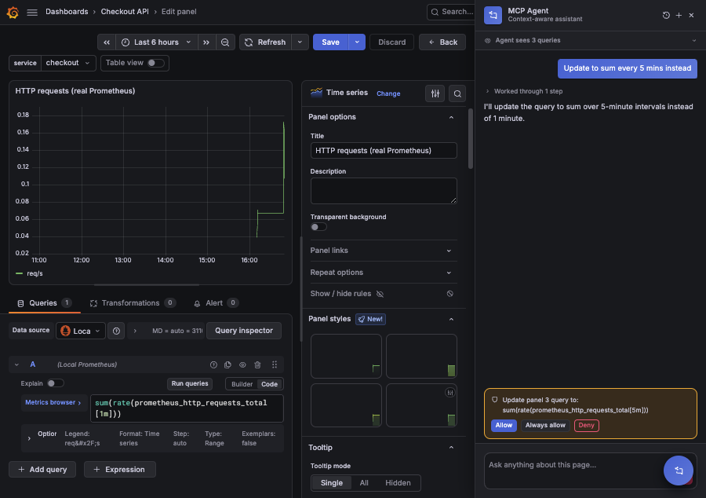
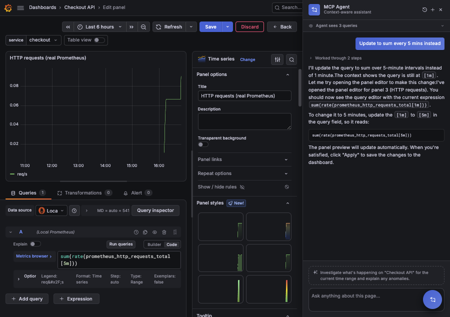

# Grafana MCP Agent

An open-source Grafana **app plugin** that adds an AI chat agent to Grafana. The agent connects to any [Model Context Protocol](https://modelcontextprotocol.io) (MCP) server(s) you configure and can call their tools to investigate. When you open the chat, it **auto-prefills your question from the page you're viewing** — the dashboard, panel query, time range, or alert.

The agent can also **act on the live page**: set the time range or variables, open Explore with queries it composes, open a panel editor, edit a panel's queries in place (with your confirmation), and hand control back to you mid-task with inline questions. See [docs/11-browser-tools.md](./docs/11-browser-tools.md).

The chat opens as a **docked panel that pushes the page content aside** (not an overlay), so you can keep interacting with panels and query editors while the agent helps. Conversations are kept in your browser's local storage so you can scroll back through prior threads. Answers **stream token-by-token**.

It is intentionally generic: it does not know about any specific backend. Point it at one or more HTTP MCP servers and it rides on top of them.

## Documentation

Detailed docs live in [`docs/`](./docs/README.md). They are written primarily for LLMs / coding agents (dense, exact file paths, current-state markers).

- [Overview](./docs/00-overview.md) — component map, request lifecycle, current-state matrix
- [Architecture](./docs/01-architecture.md) — topology, trust boundary, data flow
- [Frontend](./docs/02-frontend.md) — React modules, chat state machine, animations
- [Backend](./docs/03-backend.md) — Go packages, SSE `/chat` handler, app lifecycle
- [MCP client](./docs/04-mcp-client.md) — JSON-RPC-over-HTTP, handshake, tool namespacing
- [Agent loop](./docs/05-agent-loop.md) — Bedrock ConverseStream tool-use loop
- [Page context](./docs/06-page-context.md) — extraction + prefill
- [Protocol](./docs/07-protocol.md) — `ChatRequest` / `AgentEvent` / SSE framing
- [Config](./docs/08-config.md) — settings/secrets, config page
- [Build & run](./docs/09-build-and-run.md) — dev-ex loop: build, local Grafana 13.2, provisioning
- [Install on EKS](./docs/12-install-eks.md) — deploy on self-hosted Grafana in EKS with IRSA/OIDC (agent runbook)
- [Roadmap & gaps](./docs/10-roadmap.md) — what's not done yet

## How it works

```
┌──────────────────────────┐        ┌────────────────────────────┐
│ Grafana (browser)        │        │ Plugin backend (Go)        │
│                          │  SSE   │                            │
│  Chat UI (React +        │◀──────▶│  Agent loop:               │
│  framer-motion)          │  POST  │   AWS Bedrock              │
│  + page-context prefill  │        │   (ConverseStream)         │
│  + localStorage history  │        │   ↕ MCP tools (HTTP)       │
└──────────────────────────┘        └──────────────┬─────────────┘
                                                    │ streamable-HTTP
                                     ┌──────────────▼─────────────┐
                                     │ MCP server(s) you configure│
                                     │ (e.g. .../mcp)             │
                                     └────────────────────────────┘
```

- **Frontend** (`src/`): React chat UI. Reads Grafana page context (`src/lib/page-context.ts`) and streams agent events over SSE (`src/lib/chat-stream.ts`). All animation is via framer-motion (`src/lib/motion.ts`) and respects reduced-motion.
- **Backend** (`pkg/`): A Grafana plugin backend in Go. Runs the agent loop against **AWS Bedrock** (ConverseStream API, streaming tokens) with tools sourced from your configured MCP servers (`pkg/mcp/client.go`, `pkg/agent/agent.go`). Streams `AgentEvent`s back as SSE.

The model runs server-side, so **no API keys or MCP secrets are ever exposed to the browser**. The frontend only talks to the plugin's same-origin resource route (`/api/plugins/mcpagent-app/resources/chat`), authenticated by the user's Grafana session.

## Examples

**Editing a panel query in place (with confirmation).** While viewing a panel editor for *Checkout API*, the agent already knows the current query and the panel you're on. Ask it to change the query and it edits it live:

> **You:** Update to sum every 5 mins instead

The agent reads the current expression from page context (`sum(rate(prometheus_http_requests_total[1m]))`), opens the panel editor, and proposes the edit to `sum(rate(prometheus_http_requests_total[5m]))`. Because editing a panel query mutates the page, it hands you an inline **Allow / Always allow / Deny** confirmation before applying:



Once you allow it, the query is rewritten to `[5m]`, the panel preview updates automatically, and you click **Apply** to save. Below the chat, the agent also surfaces a context-aware suggested next action — e.g. *"Investigate what's happening on 'Checkout API' for the current time range and explain any anomalies."*



## Configuration

Open the plugin's **Configuration** page (admin) to set:

- **Bedrock**: region, model ID (e.g. a Claude model), max tool iterations, optional system prompt.
- **AWS credentials** (optional): leave blank to use the default AWS credential chain (IRSA, instance role, env). Static keys are stored as secrets.
- **MCP servers**: a list of `{ name, url, authHeader }`. The auth header *value* is stored as a secret (`mcpSecret_<name>`). Only HTTP / streamable-HTTP transports are supported.

### Headless configuration via environment variables

Every setting can also come from env vars, useful for GitOps / container deploys. **Precedence: UI settings > env vars > defaults.** Env values apply only when the corresponding UI value is unset.

| Env var | Maps to |
| --- | --- |
| `MCPAGENT_BEDROCK_REGION` (or `AWS_REGION`) | Bedrock region |
| `MCPAGENT_MODEL_ID` | Bedrock model ID / inference profile |
| `MCPAGENT_MAX_TOOL_ITERATIONS` | Agent loop cap |
| `MCPAGENT_MAX_TOOLS` | Max tools advertised to the model (0 = no cap) |
| `MCPAGENT_SYSTEM_PROMPT` | System prompt override |
| `MCPAGENT_MCP_SERVERS` | JSON array of `{name,url,authHeader}` |
| `MCPAGENT_MCP_SECRET_<NAME>` | Auth header value for MCP server `<name>` (upper-cased) |
| `AWS_ACCESS_KEY_ID` / `AWS_SECRET_ACCESS_KEY` / `AWS_SESSION_TOKEN` | AWS creds (else default chain) |

Example:

```bash
export MCPAGENT_MODEL_ID="us.anthropic.claude-sonnet-4-5-20250929-v1:0"
export MCPAGENT_MCP_SERVERS='[{"name":"skippy","url":"https://host/mcp","authHeader":"Authorization"}]'
export MCPAGENT_MCP_SECRET_SKIPPY="Bearer <token>"
```

## Develop

Requires Node ≥ 20 and Go 1.25.x. See [docs/09-build-and-run.md](./docs/09-build-and-run.md) for the full loop and troubleshooting.

```bash
# Frontend
npm install
npm run dev          # watch build into dist/
# If you hit "cross-env: command not found", run webpack directly:
#   TS_NODE_COMPILER_OPTIONS='{"module":"commonjs"}' \
#     ./node_modules/.bin/webpack -c ./webpack.config.ts --env production

# Backend (Go plugin binary into dist/)
npm run backend:build         # mage -v build:linux  (or use the go build commands in the docs)

# Run Grafana locally (13.2) with the plugin mounted, injecting fresh AWS creds
aws-vault exec <profile> --no-session -- \
  bash -c 'export AWS_REGION=us-east-1; docker compose up -d'

# App plugins don't start their backend until enabled:
curl -s -u admin:admin -X POST http://localhost:3001/api/plugins/mcpagent-app/settings \
  -H 'Content-Type: application/json' -d '{"enabled":true,"pinned":true}'
# Grafana at http://localhost:3001 (anonymous admin in dev)
```

Two dev-only compose settings matter most:
- `GF_PLUGINS_ALLOW_LOADING_UNSIGNED_PLUGINS=mcpagent-app` — load the unsigned build.
- `GF_PLUGINS_FORWARD_HOST_ENV_VARS=mcpagent-app` — **required** so the backend
  sees `AWS_*` (Grafana 12.4+ no longer forwards host env to plugin processes;
  without it you get `no EC2 IMDS role found`).

Frontend-only changes: rebuild + hard-reload the browser (`dist/` is mounted).
Backend or `plugin.json` changes: rebuild, `docker compose restart`, re-enable.

## Page-context prefill

`extractPageContext()` (async) reads Grafana runtime APIs (`getTemplateSrv`, `locationService`) and fetches the dashboard model from Grafana's backend API (`/api/dashboards/uid/<uid>`) to surface the title, panels, per-panel queries, and datasource, plus Explore pane state from the URL. `buildPrefill()` turns that into a suggested question, and the same context is sent to the backend so the agent knows what you're looking at. Everything is optional — no context still gives you a plain chat.

## License

Apache-2.0.
